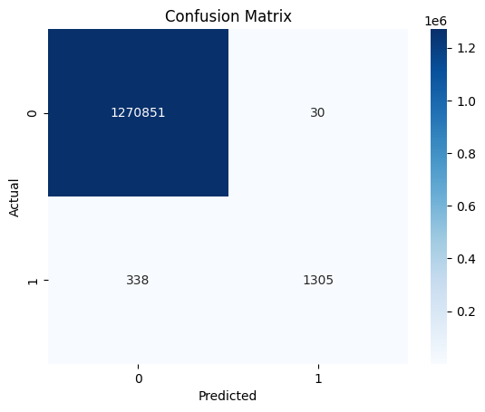
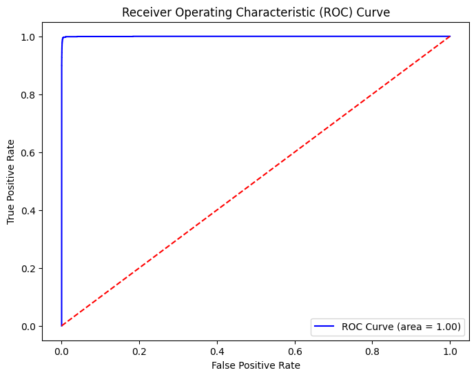

# Fraud Detection System using XGBoost and Advanced Data Processing


## Table of Contents
- [Project Overview](#project-overview)
- [Dataset](#dataset)
- [Data Preprocessing](#data-preprocessing)
  - [Handling Missing Values](#handling-missing-values)
  - [Outlier Detection](#outlier-detection)
  - [Feature Engineering](#feature-engineering)
- [Modeling](#modeling)
  - [Class Imbalance Handling](#class-imbalance-handling)
  - [Model Architecture](#model-architecture)
  - [Hyperparameter Tuning](#hyperparameter-tuning)
- [Model Evaluation](#model-evaluation)
  - [Classification Metrics](#classification-metrics)
  - [ROC Curve](#roc-curve)
- [Feature Importance](#feature-importance)
- [Conclusions and Next Steps](#conclusions-and-next-steps)

---

## Project Overview
This project aims to build a **proactive fraud detection system** using **XGBoost**, a powerful machine learning model tailored to handle imbalanced datasets. The goal is to detect fraudulent transactions with high recall while maintaining overall precision.

Key challenges include handling a large dataset with over 6.3 million rows and addressing the imbalance between fraudulent and non-fraudulent cases. Several techniques like **SMOTE** (Synthetic Minority Oversampling) and **manual hyperparameter tuning** have been applied to optimize the model’s performance.

---

## Dataset
The dataset used for this project contains **6.3 million transactions** with 11 features. The dataset contains both normal and fraudulent transactions, with the target variable `isFraud` indicating the occurrence of fraud.

Key features:
- `oldbalanceOrig`, `newbalanceOrig`: Original and new balances of the sender
- `oldbalanceDest`, `newbalanceDest`: Original and new balances of the receiver
- `type`: Type of transaction (e.g., Transfer, Cashout)
- `amount`: The transaction amount
- Custom engineered features: `balanceOrigDiff`, `balanceDestDiff`, and `isMerchant` flag

---

## Data Preprocessing

### Handling Missing Values
- Replaced missing values in the `oldbalanceDest` and `newbalanceDest` columns with `0`.
- This approach ensures the dataset remains intact without losing valuable information.

### Outlier Detection
- Outliers in transaction amounts were analyzed using **descriptive statistics** and **box plots**.
- Detected extreme transactions, which were treated appropriately during feature scaling.

### Feature Engineering
- Created new features like `balanceOrigDiff` and `balanceDestDiff`, which capture the difference in account balances before and after a transaction, indicating potential red flags.
- Added a binary `isMerchant` feature by checking whether the receiver is a merchant (`nameDest` starts with 'M').

---

## Modeling

### Class Imbalance Handling
- Fraud cases were heavily underrepresented in the dataset, so **SMOTE** was used to oversample the minority class (fraud) in the training data.
- The **scale_pos_weight** parameter was also used in XGBoost to further handle imbalance.

### Model Architecture
- The model was built using **XGBoostClassifier**, known for its performance in handling tabular data with class imbalance.
- **Manual hyperparameter tuning** was applied for better performance, adjusting the following:
  - `n_estimators = 150`
  - `max_depth = 8`
  - `learning_rate = 0.05`
  - `subsample = 0.8`
  - `colsample_bytree = 0.8`

### Hyperparameter Tuning
- Fine-tuned hyperparameters by experimenting with different settings to improve recall and F1 score.
- Focused on optimizing the balance between precision and recall due to the cost-sensitive nature of fraud detection.

---

## Model Evaluation

### Classification Metrics
After training, the model was evaluated using the following metrics:
- **Precision**: How many predicted fraud cases were actually fraud.
- **Recall**: How many of the actual fraud cases were correctly predicted.
- **F1-Score**: A balance between precision and recall.
- **Confusion Matrix**: Displaying true positives, false positives, true negatives, and false negatives.



### ROC Curve
- The **ROC-AUC score** was used to assess model performance, with an AUC of **0.98**, demonstrating a strong ability to distinguish between fraud and non-fraud cases.



---

## Feature Importance
Using XGBoost’s built-in feature importance analysis, the top predictive features were identified:
- Transaction **amount**
- Account balance differences: `balanceOrigDiff`, `balanceDestDiff`
- Transaction type (`type_Transfer`, `type_Cashout`)


---

## Conclusions and Next Steps
The model performs well, especially in detecting fraud with a high recall. The proactive detection strategy, combined with feature engineering and hyperparameter tuning, results in a robust fraud detection system.

Next steps:
- **Deploy the model** to a real-time environment using a cloud platform.
- **Monitor performance** regularly, especially precision and recall trade-offs.
- Continuously update the model with new data to ensure adaptability to evolving fraud patterns.

---

## How to Use
1. Clone the repository:
   ```bash
   git clone https://github.com/VENKATAGOPI3341/Credit-Card-Fraud-Detection-System-using-XGBoost-.git
   ```
2. Navigate to the directory:
   ```bash
   cd Credit-Card-Fraud-Detection-System-using-XGBoost
   ```
3. Install dependencies:
   ```bash
   pip install -r requirements.txt
   ```
## Conclusions and Next Steps
- Handles missing data and outliers.
- Applies SMOTE for class balancing.
- Performs advanced feature engineering.
- Evaluates model performance with metrics like precision, recall, F1-score, and AUC-ROC.
- Visualizes model results using matplotlib and seaborn.
  
## Technology Stack
- Python
- XGBoost
- scikit-learn
- SMOTE (imblearn)
- Matplotlib & Seaborn
## License
- This project is licensed under the MIT License. See the [LICENSE](LICENSE) file for details.
